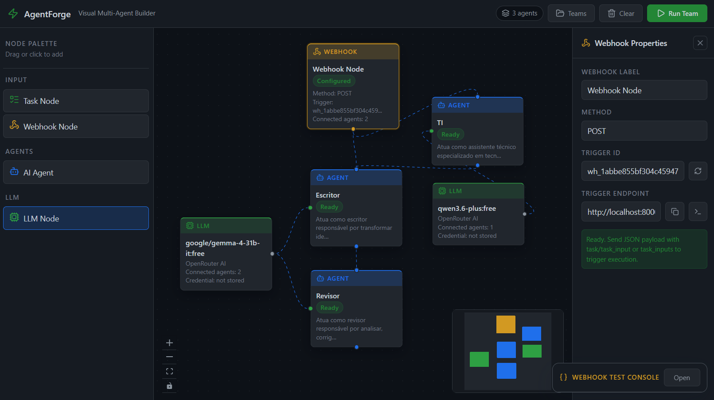

# Visual Multi-Agent Team Builder

Este é um repositório contendo uma aplicação Fullstack (Frontend e Backend) dedicada à construção visual de equipes de agentes de Inteligência Artificial. A aplicação permite a definição de fluxos de trabalho, orquestração de agentes e configuração de diferentes provedores de LLMs através de uma interface gráfica baseada em nós estruturada para facilitar o desenvolvimento e execução de casos de uso multi-agentes.

## Preview da Aplicação



## Sobre o Projeto

Este projeto tem como propósito apresentar, na prática, um estudo de caso baseado em desenvolvimento orientado a especificações (*Spec-Driven Development* — SDD). Ao longo de todo o seu ciclo de vida, as decisões de implementação, evolução e automação são conduzidas por essa abordagem, em conjunto com o uso de tecnologias avançadas baseadas em agentes autônomos.

Entre as principais ferramentas utilizadas neste laboratório, destacam-se:

- **Antigravity**: agente de IA avançado voltado à automação de tarefas e à programação assistida com alta paridade de execução.
- **Opencode**: conjunto de ferramentas auxiliares para integração local com o IDE.
- **Openspec**: especificações estruturadas que atuam como fonte única de verdade (*Single Source of Truth*) para orientar o agente autônomo.

Recomendamos o uso do **Opencode**. Para habilitar integralmente as automações do agente, incluindo *skills* e fluxos de trabalho, é necessário instalar os recursos adicionais com o comando abaixo.

> **Observação:** a pasta `.agents` não é versionada neste repositório, pois possui volume elevado de arquivos.

```ps1
npx antigravity-awesome-skills --path .agents/skills
```

## Arquitetura

O repositório está estruturado em módulos distintos:
- `/frontend`: Interface gráfica desenvolvida com uma stack web moderna, focada no fluxo de trabalho baseado na arquitetura visual de nós.
- `/backend`: Servidor REST construído em Python, responsável por inicializar os agentes, orquestrar fluxos e gerenciar os provedores de serviços de LLM e lógica de roteamento de tarefas.
- `/openspec`: Documentos textuais delineando especificações operacionais e especificações arquiteturais consumidas pelas ferramentas SDD.

## Instruções de Uso (Getting Started)

### Pré-requisitos
- Node.js (versão 18 ou superior)
- Python (versão 3.10 ou superior)

### Configuração do Backend (FastAPI / Python)

1. Abra um terminal e navegue para o diretório de backend:
   ```ps1
   cd backend
   ```
2. Crie e ative um ambiente virtual (opcional, porém recomendado):
   ```ps1
   python -m venv venv
   .\venv\Scripts\activate
   ```
3. Instale as dependências necessárias:
   ```ps1
   pip install -r requirements.txt
   ```
4. Crie o arquivo de ambiente local a partir do modelo:
   ```ps1
   copy .env.example .env
   ```
5. Inicie o servidor localmente:
   ```ps1
   uvicorn main:app --reload --port 8000
   ```
O backend estará executando em `http://localhost:8000`.

### Test Provider: fallback de credenciais e precedência

Para provedores com chave (`openai`, `openrouter`/`opencode`, `anthropic`, `google`), a ação **Test Provider** no painel LLM segue esta precedência de chave no backend:

1. `apiKey` explícita enviada pela UI (quando preenchida)
2. `credentialRef` já salvo no nó
3. variável de ambiente do provedor no backend

Se nenhuma fonte estiver disponível, o backend retorna erro com orientação de configuração.

Mapeamento de variáveis de ambiente para fallback:

- `OPENAI_API_KEY`
- `OPENROUTER_API_KEY` (também usado para `opencode`)
- `ANTHROPIC_API_KEY`
- `GOOGLE_API_KEY`

Quando o teste é bem-sucedido e existe contexto de nó (`team_id` + `node_id`), a chave efetiva validada é persistida com criptografia e o nó recebe/atualiza `credentialRef`; o campo `apiKey` não é persistido no grafo.

### Baseline de Segurança (ambientes não-dev)

Onde configurar:

- As variáveis devem ser definidas no **ambiente do backend** (container, VM, secret manager ou serviço de deploy).
- Para facilitar, use os arquivos modelo em `backend/` e renomeie conforme o ambiente.

Arquivos modelo criados:

- `backend/.env.example` (desenvolvimento local)
- `backend/.env.test.example` (teste)
- `backend/.env.staging.example` (staging)
- `backend/.env.production.example` (produção)

Sugestão de uso:

- Teste: copie `backend/.env.test.example` para `backend/.env.test`
- Staging: copie `backend/.env.staging.example` para `backend/.env.staging`
- Produção: copie `backend/.env.production.example` para `backend/.env.production`
- Defina `APP_ENV` como `test`, `staging` ou `production` no processo de execução.

Baseline recomendado para ambientes não-dev:

- `APP_ENV=staging` ou `APP_ENV=production`
- `API_BEARER_TOKEN=<token-forte>`
- `CREDENTIAL_ENCRYPTION_KEY=<chave-longa-aleatoria>`
- `CORS_ALLOW_ORIGINS=https://seu-frontend.com`
- `AUTH_ENABLED=true`
- `RATE_LIMIT_ENABLED=true`
- `RATE_LIMIT_WINDOW_SECONDS=60`
- `RATE_LIMIT_EXECUTE_REQUESTS=10`
- `RATE_LIMIT_PROVIDER_TEST_REQUESTS=30`

Observação importante:

- Arquivos `backend/.env*` (exceto `*.example`) estão no `.gitignore` para evitar versionamento de segredos.
- Variáveis já definidas no ambiente do sistema/deploy têm prioridade sobre os valores dos arquivos.

Provisionamento de chave de credencial (`CREDENTIAL_ENCRYPTION_KEY`):

- Gere uma chave longa aleatória (32+ bytes efetivos).
- Recomendação prática: **64 caracteres hex** (equivalente a 32 bytes), por exemplo:
  `9f4c2b7e8a31d6f0c5b94a1e7d2f8c6b3a91e4d7f0b2c8a56e1d9f3c7b4a2e8`.
- Armazene a chave somente no ambiente de execução (nunca no repositório).
- Mantenha backup seguro da chave ativa durante a janela de migração/rollback, pois credenciais persistidas dependem dela para descriptografia.

Recomendação para token de acesso da API (`API_BEARER_TOKEN`):

- Gere um segredo aleatório com alta entropia (mínimo recomendado: 32 bytes).
- Recomendação prática: **base64url com 48 bytes** (normalmente ~64 caracteres).
- Não reutilize a mesma chave de provedores externos (ex.: OpenRouter) como bearer token da sua API.

Exemplos de geração (Python):

```ps1
# 32 bytes em hex (64 chars) - bom para CREDENTIAL_ENCRYPTION_KEY
python -c "import secrets; print(secrets.token_hex(32))"

# 48 bytes em base64url (~64 chars) - bom para API_BEARER_TOKEN
python -c "import secrets; print(secrets.token_urlsafe(48))"
```

Procedimento de rollback / feature-flag de emergência:

1. Se necessário, desative autenticação temporariamente com `AUTH_ENABLED=false`.
2. Se necessário, desative throttling temporariamente com `RATE_LIMIT_ENABLED=false`.
3. Investigue a causa e reative os controles (`true`) assim que possível.

### Configuração do Frontend (Vite + Node)

1. Abra um novo terminal na raiz do projeto e acesse o diretório frontend:
   ```ps1
   cd frontend
   ```
2. Instale as dependências listadas:
   ```ps1
   npm install
   ```
3. Execute o ambiente de desenvolvimento local:
   ```ps1
   npm run dev
   ```
Por fim, basta acessar o sistema pelo seu navegador através da URL indicada no terminal (frequentemente `http://localhost:5173`).

## Recomendações

Para quem tiver interesse em testar a aplicação de maneira acessível e flexível, recomendamos a utilização dos modelos gratuitos disponibilizados pela OpenRouter.

Você pode conferir a lista de modelos de inteligência artificial sem custo através do link:
- [OpenRouter - Free Models](https://openrouter.ai/models?q=free)

Para obter sua chave de acesso (API Key), basta gerá-la pelo painel:
- [OpenRouter Keys](https://openrouter.ai/workspaces/default/keys)

Com sua chave gerada, você poderá utilizá-la em quantos nós (nodes) de LLMs desejar nos fluxos de trabalho (workflows) da interface da aplicação.
